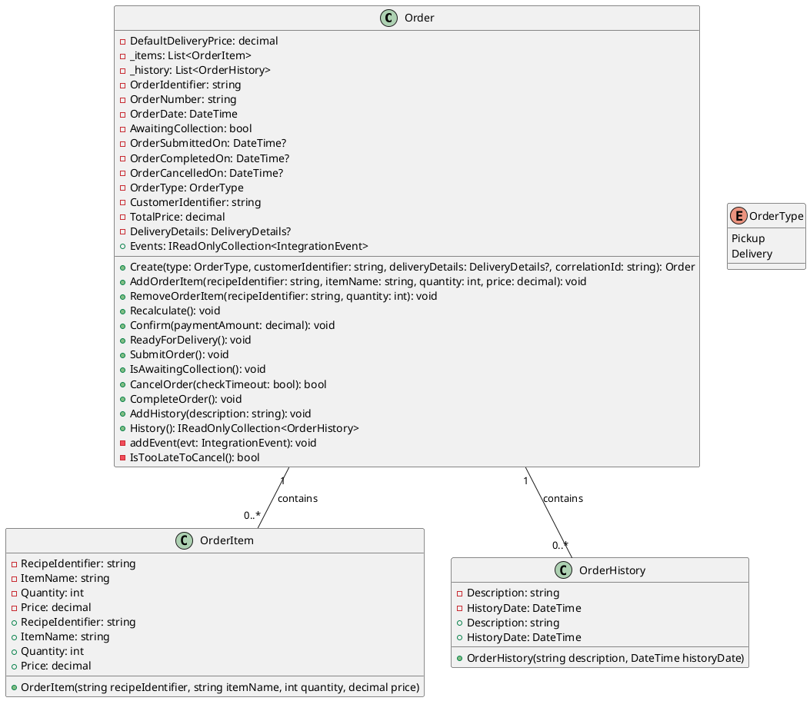
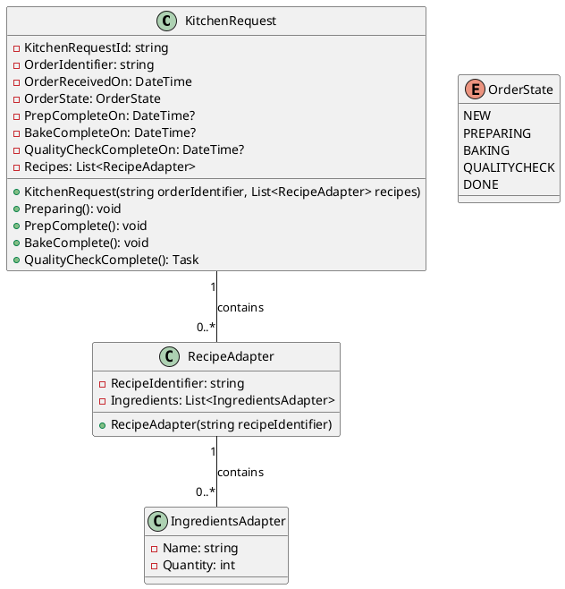
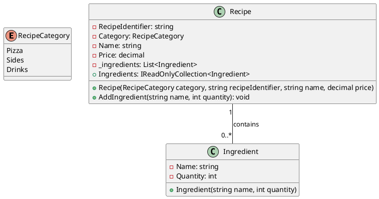

### Entities

#### OrdersMicroservice

```plantuml
@startuml
class Order {
    - DefaultDeliveryPrice: decimal
    - _items: List<OrderItem>
    - _history: List<OrderHistory>
    - OrderIdentifier: string
    - OrderNumber: string
    - OrderDate: DateTime
    - AwaitingCollection: bool
    - OrderSubmittedOn: DateTime?
    - OrderCompletedOn: DateTime?
    - OrderCancelledOn: DateTime?
    - OrderType: OrderType
    - CustomerIdentifier: string
    - TotalPrice: decimal
    - DeliveryDetails: DeliveryDetails?
    + Create(type: OrderType, customerIdentifier: string, deliveryDetails: DeliveryDetails?, correlationId: string): Order
    + AddOrderItem(recipeIdentifier: string, itemName: string, quantity: int, price: decimal): void
    + RemoveOrderItem(recipeIdentifier: string, quantity: int): void
    + Recalculate(): void
    + Confirm(paymentAmount: decimal): void
    + ReadyForDelivery(): void
    + SubmitOrder(): void
    + IsAwaitingCollection(): void
    + CancelOrder(checkTimeout: bool): bool
    + CompleteOrder(): void
    + AddHistory(description: string): void
    + History(): IReadOnlyCollection<OrderHistory>
    + Events: IReadOnlyCollection<IntegrationEvent>
    - addEvent(evt: IntegrationEvent): void
    - IsTooLateToCancel(): bool
}
class OrderItem {
    - RecipeIdentifier: string
    - ItemName: string
    - Quantity: int
    - Price: decimal
    + OrderItem(string recipeIdentifier, string itemName, int quantity, decimal price)
    + RecipeIdentifier: string
    + ItemName: string
    + Quantity: int
    + Price: decimal
}

class OrderHistory {
    - Description: string
    - HistoryDate: DateTime
    + OrderHistory(string description, DateTime historyDate)
    + Description: string
    + HistoryDate: DateTime
}

enum OrderType {
    Pickup
    Delivery
}


Order "1" -- "0..*" OrderItem : contains
Order "1" -- "0..*" OrderHistory : contains

@enduml
```

#### KitchenMicroservice

```plantuml
@startuml
class KitchenRequest {
    - KitchenRequestId: string
    - OrderIdentifier: string
    - OrderReceivedOn: DateTime
    - OrderState: OrderState
    - PrepCompleteOn: DateTime?
    - BakeCompleteOn: DateTime?
    - QualityCheckCompleteOn: DateTime?
    - Recipes: List<RecipeAdapter>
    + KitchenRequest(string orderIdentifier, List<RecipeAdapter> recipes)
    + Preparing(): void
    + PrepComplete(): void
    + BakeComplete(): void
    + QualityCheckComplete(): Task
}

enum OrderState {
    NEW
    PREPARING
    BAKING
    QUALITYCHECK
    DONE
}

class RecipeAdapter {
    - RecipeIdentifier: string
    - Ingredients: List<IngredientsAdapter>
    + RecipeAdapter(string recipeIdentifier)
}

class IngredientsAdapter {
    - Name: string
    - Quantity: int
}

RecipeAdapter "1" -- "0..*" IngredientsAdapter : contains

KitchenRequest "1" -- "0..*" RecipeAdapter : contains
@enduml
```

#### RecipeMicroservice

```plantuml
@startuml
enum RecipeCategory {
    Pizza
    Sides
    Drinks
}

class Recipe {
    - RecipeIdentifier: string
    - Category: RecipeCategory
    - Name: string
    - Price: decimal
    - _ingredients: List<Ingredient>
    + Recipe(RecipeCategory category, string recipeIdentifier, string name, decimal price)
    + AddIngredient(string name, int quantity): void
    + Ingredients: IReadOnlyCollection<Ingredient>
}

class Ingredient {
    - Name: string
    - Quantity: int
    + Ingredient(string name, int quantity)
}

Recipe "1" -- "0..*" Ingredient : contains
@enduml
```